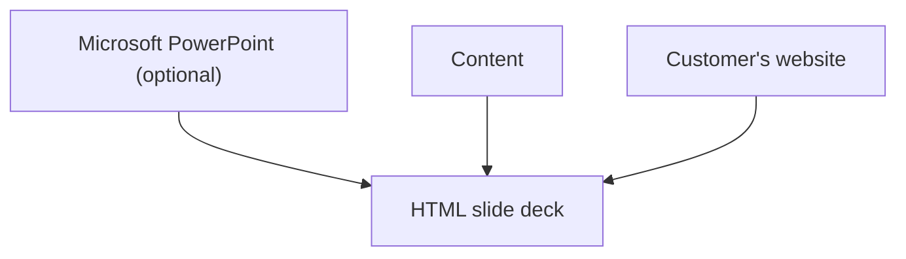

# Pretty Azure customer-facing deck

A Copilot skill that turns source content, an optional PowerPoint, and a customer's website into a polished, animated HTML slide deck. It combines official Microsoft assets and Fluent styling with customer-specific branding, sourced claims, and deliberate non-template layouts, delivered as separate HTML, CSS, and JavaScript files.

[Skill](creating-a-customer-branded-azure-deck/SKILL.md) · [Security](SECURITY.md) · [Contributing](CONTRIBUTING.md) · [Code of Conduct](CODE_OF_CONDUCT.md) · [Support](SUPPORT.md) · [MIT License](LICENSE)
